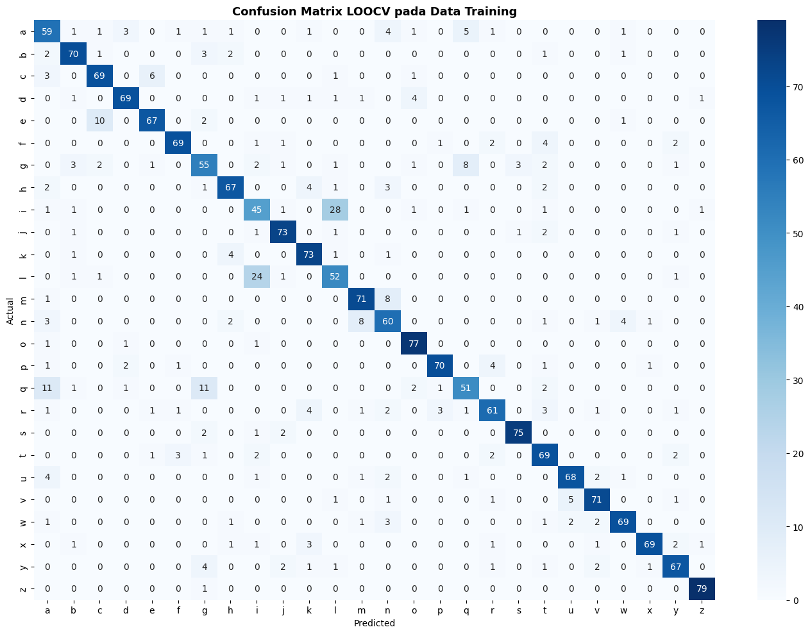
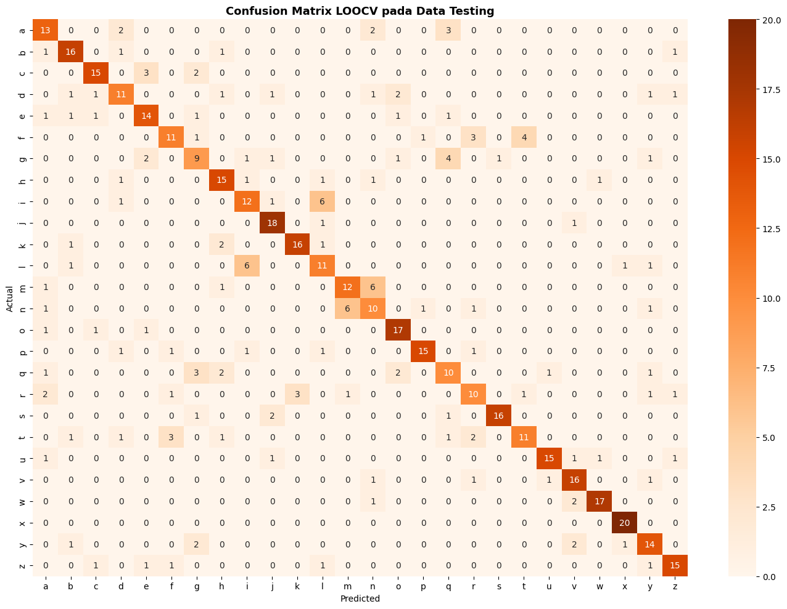
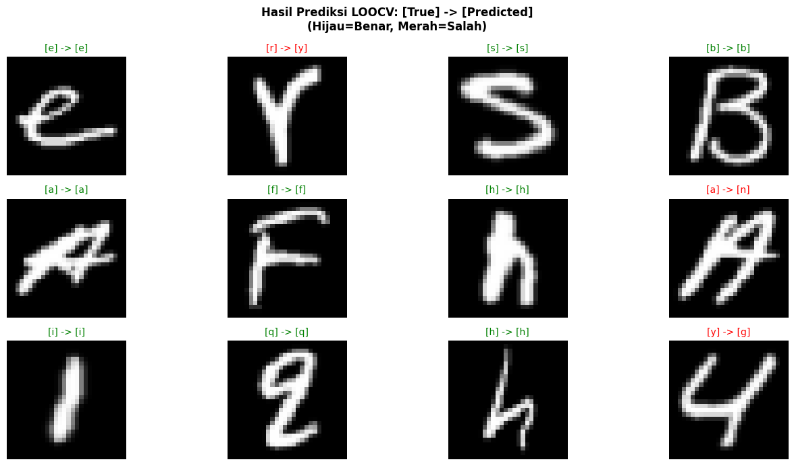

# EMNIST Letter Recognition — SVM + HOG

Letter classification from the EMNIST dataset using **HOG (Histogram of Oriented Gradients)** for feature extraction and **SVM (Support Vector Machine)** as the classifier.

---

## Method

- **Dataset**: EMNIST Letters
- **Feature Extraction**: HOG (Histogram of Oriented Gradients)
- **Classifier**: Support Vector Machine (SVM)

---

## Results

### Confusion Matrix — Train Data

### Confusion Matrix — Test Data

### Prediction Results

---
